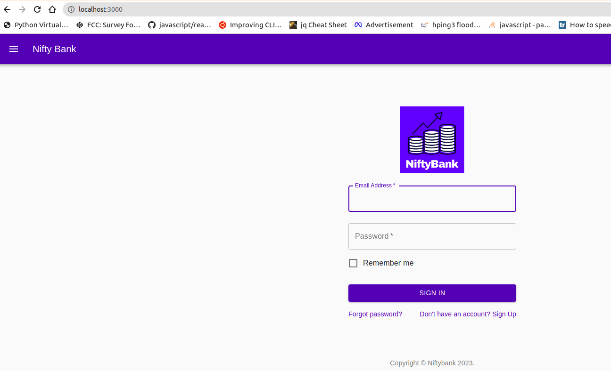

# SecureStack Octernship Submission


<a href="https://securestack.com" target=”_blank” rel="noopener noreferrer"><center></center></a>

### Task submission by [Brandonawan](https://github.com/Brandonawan/)

Here are the issues I found in the "Find some bugs!" GitHub Classroom:

#### Bug 1: Denial-of-Service (DoS) attack
A Denial of Service (DoS) attack is an attempt to overwhelm a server or network resource with a flood of requests in order to disrupt or disable its normal operation. The webapp [app.cheapcryptobank.com](https://app.cheapcryptobank.com/) is vulnerable to Denial-of-Service attack using `hping3`
Attack was executed using the command below.
```sudo hping3 app.cheapcryptobank.com -q -n -d 120 -S -p 80 --flood --rand-source```

##### Sample Output


#### Solution
* Implement DDoS mitigation tools: Deploying DDoS mitigation tools and services can help prevent attacks before they reach your network. These tools can detect and block malicious traffic in real-time, helping to ensure that your network stays up and running.
* Implement access controls
* Increase your bandwidth


#### Bug 2: Missing [alt] attribute
Image elements do not have [alt] attributes, 

##### Sample Output


#### Solution
I implemented this solution to the code.. by adding `alt="Niftybank"` to the ``

#### Bug 3: Button does not have an accessible name
The css style does define the button with proper

##### Sample Output


#### Bug 4: Expose credentials
Sensitive credentials found inside `app.config` file were expose or check into git.. this can lead to serious security damage

#### Solution
* Create a ```.gitignore``` file and add ```app.config``` to it, to avoid accidentially pushing it to git.

#### Bug 5: Forked code not working locally.
The code that was forked from the original repository is missing the `public` folder
#### Solution
I created a the expected folder, added the required index.html and got it working.
##### Sample Output



#### Bug 6: Missing ```.gitignore``` file
A ```.gitignore```file is a configuration file used by Git to specify files and directories that should be excluded from version control. When you add a file to a Git repository, it is automatically tracked by Git and included in the repository's history.

#### Solution
Create a ```.gitignore``` file add the file(s) to exclude.

#### Bug 7: Missing HSTS
The HSTS was not included in the config file. This can allow users to access the application over HTTP, potentially exposing it to threats like SSL-stripping, man-in-the-middle attacks, and cookie hijacking. 

#### Solution
Add an STS header in the server config file to enable HSTS and redirect all requests over HTTPS: 
```
Strict-Transport-Security: max-age=31536000; includeSubDomains; preload
```

#### Bug 8: Expose _authToken
Authentication token expose inside the `.npmrc` file.

#### Solution
Create a ```.gitignore``` file, add ```.npmrc``` to it for push exception to git.

### Reference:
* [Denial-of-Service attack:](https://linuxhint.com/hping3/)
* [accessibility guide](https://www.google.com/accessibility/)
* [hsts](https://kinsta.com/knowledgebase/hsts-missing-from-https-server/)